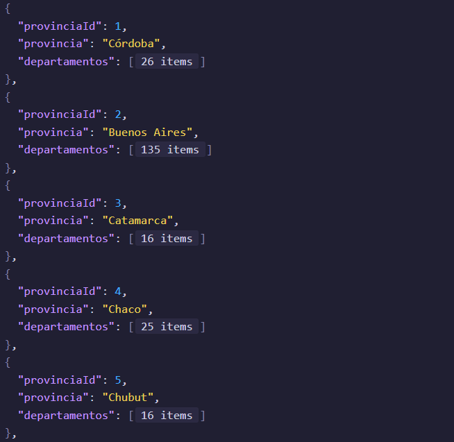
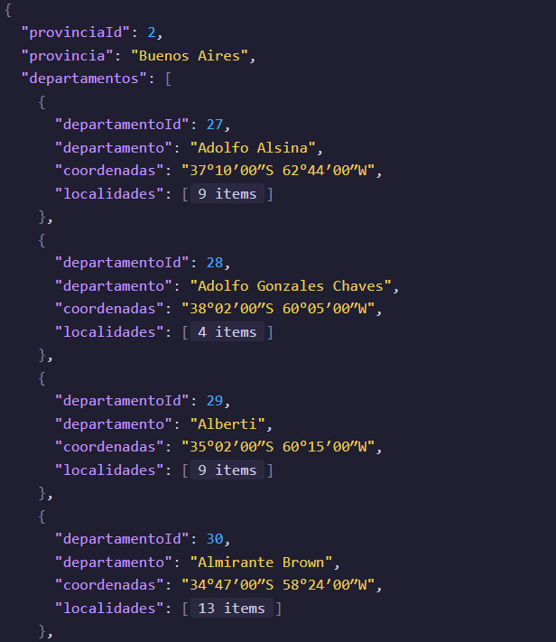
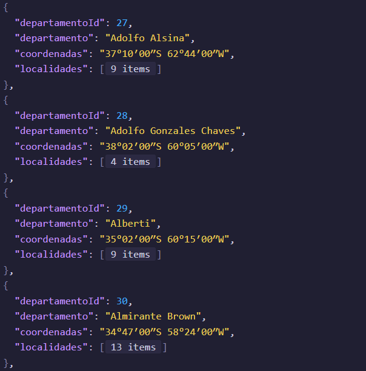
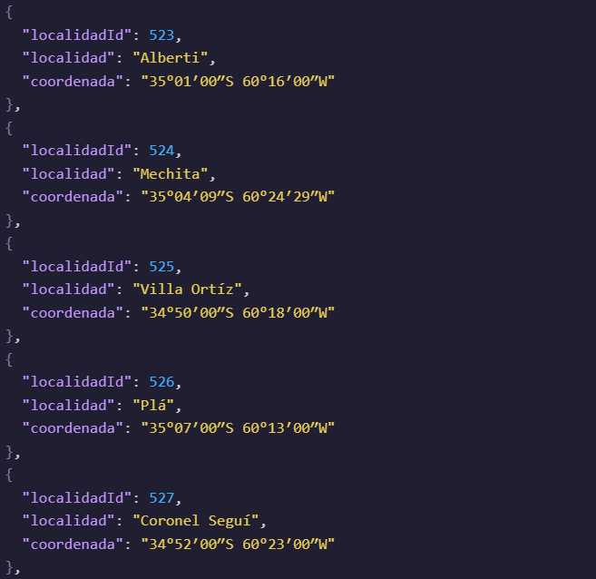

# Localidades Argentinas

Bienvenido a la API de **Localidades de Argentina**. Esta te permite acceder a información sobre _provincias_, _departamentos_ y _localidades_ del país.
Fué creada debido a la falta de información completa, no óptima y difícil implementación en proyectos que necesiten delimitar un terriorio específico.

Cuenta con un total de **24 archivos .json**, los cuales se dividen en **1** archivo con **todas las Provincias** y **23** archivos divididos por **cada Provincia**.
 
 

## Endpoints 📌

Es posible acceder a **5 endpoints** diferentes, los cuales te permiten obtener diferente información dependiendo de lo que se requiera.
 
 

- ### Obtener Todas las Provincias

**URL:** `/api/provincias`
 
 
**Método:** `GET`
 
 
**Descripción:** Devuelve una lista de todas las Provincias.
 
 
**EJEMPLO DE SOLICITUD:**
`https://localidades-argentinas-data.vercel.app/api/provincias`
 
 
**EJEMPLO DE RESPUESTA:**
 

 
 

- ### Obtener una Provincia específica

**URL:** `/api/{provincia}`
 
 
**Método:** `GET`
 
 
**Descripción:** Devuelve una Provincia específica.
 
 
**EJEMPLO DE SOLICITUD:**
`https://localidades-argentinas-data.vercel.app/api/buenos_aires`
 
 
**EJEMPLO DE RESPUESTA:**
 

 
 

- ### Obtener Departamentos de una Provincia

**URL:** `/api/{provincia}/departamentos`
 
 
**Método:** `GET`
 
 
**Descripción:** Devuelve una Provincia específica.
 
 
**EJEMPLO DE SOLICITUD:** `https://localidades-argentinas-data.vercel.app/api/buenos_aires/departamentos`
 
 
**EJEMPLO DE RESPUESTA:**
 

 
 

- ### Obtener Localidades de un Departamento

**URL:** `/api/{provincia}/departamentos/{departamento}/localidades`
 
 
**Método:** `GET`
 
 
**Descripción:** Devuelve una Provincia específica.
 
 
**EJEMPLO DE SOLICITUD:** `https://localidades-argentinas-data.vercel.app/api/buenos_aires/departamentos/Alberti/localidades`
 
 
**EJEMPLO DE RESPUESTA:**
 

 
 

- ### Obtener Información de una Localidad Específica

**URL:** `/api/{provincia}/departamentos/{departamento}/localidades/{localidad}`
 
 
**Método:** `GET`
 
 
**Descripción:** Devuelve una Provincia específica.
 
 
**EJEMPLO DE SOLICITUD:** `https://localidades-argentinas-data.vercel.app/api/buenos_aires/departamentos/Alberti/localidades/Villa_Ortíz`
 
 
**EJEMPLO DE RESPUESTA:**
 

 
 
 

## Errores 📌

**404 Not Found** 
**500 Internal Server Error** 
**400 Bad Request**
 
 

## Tecnologías 📌

   
  
  
  
  
  

---

**Muchas Gracias por utilizar la API y mostrar interes en ella!**
 
 

**Visitá la Web oficial para obtener más información: <a href="https://localidades.vercel.app/" target="_blank">Localidades Argentinas</a>**
 
 

**Te agradecería si quieres dar apoyo y marcar con una ⭐ el repositorio. Eres más que bienvenido a realizar cualquier tipo de cambio para que el proyecto crezca y mejore!**
 

### No dudes en contactarme

- **LinkedIn:** 👉​<a href="https://www.linkedin.com/in/nicolasatapiedev30" target="_blank">LinkedIn</a>
- **Instagram:** 👉​<a href="https://www.instagram.com/nicotapie1/" target="_blank">Instagram</a>
   

<b>Un fuerte abrazo ❤️</b>

